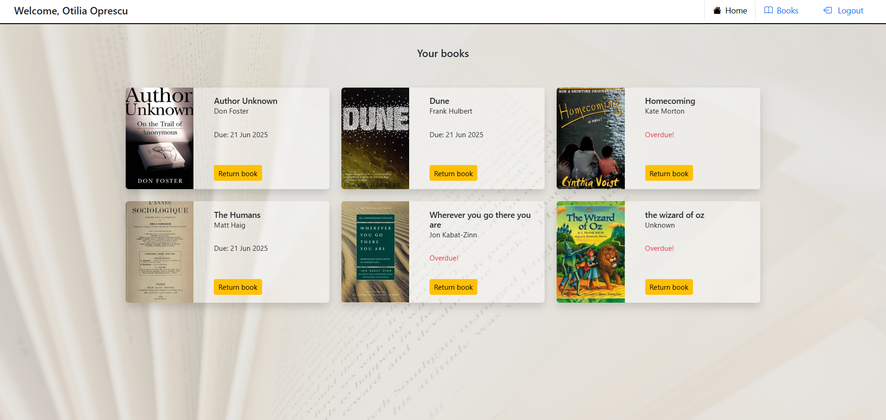
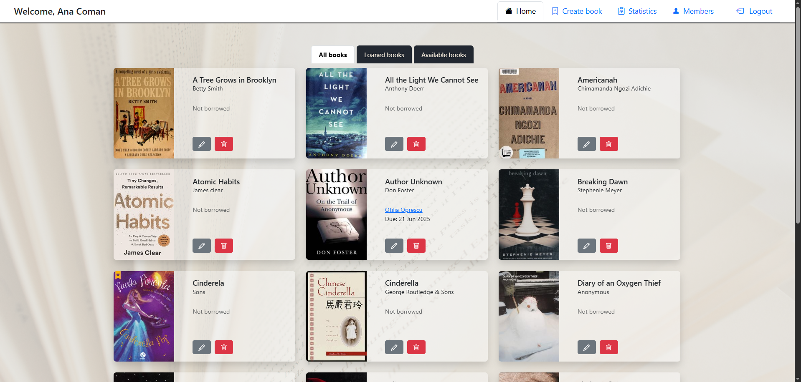
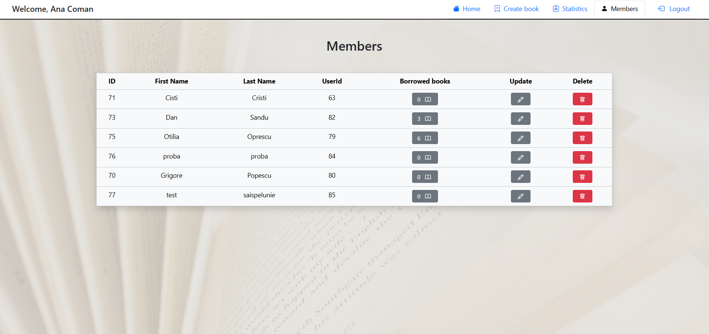
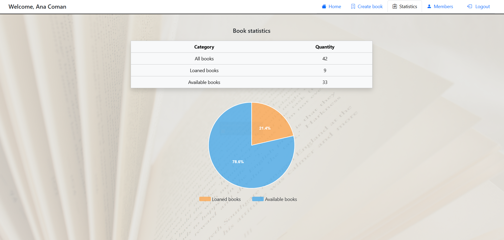

# SteadyLeafs
## online library

This is a Java web application I built with Spring Boot and Thymeleaf. Members can browse and borrow books and librarians manage the books and the members. The login functionality is differentiated by roles, so members, librarians and admin each see their own custom dashboard with actions they are allowed to do.  

## Screenshots
### Home Page

### Member Login Page

### Member Dashboard

### Librarian Dashboard

### Librarian Dashboard - member list

### Librarian Dashboard - book statistics

## Features
- Member registration and login;
- Role-based access: member/librarian|admin;
- Member panel — view available and borrowed books;
- Librarian panel — manage books and members;
- Admin panel — manage users and librarians;
- *Contact Us* functionality — send an email;
- Responsive frontend with Bootstrap;

- **Member can:**
  - View all books;
  - Search books by title or author;
  - Borrow available books (one at a time);
  - View their borrowed books, with due date;
- **Librarian can:**
  - Create books;
  - View and manage all books / loaned books / available books;
  - Check book statistics (by category and quantity);
  - View and manage members;
  - View a member's book list, with due date;
  - Return an overdue book from a specific member;
- **Admin can:**
  - View and manage users;
  - Change a user's role;
  - View and delete librarians;
  

- When created or updated, a book receives its cover from OpenLibrary external API;
- When a member is deleted, the corresponding user is also removed, and their borrowed books are returned to the library as available.

## Tech Stack
- Java 21
- Spring Boot
- PostgreSQL
- Thymeleaf
- Bootstrap

## To Do
- [ ] Confirm book creation + show spinner;
- [x] Add pagination to book list;
- [x] Implement search functionality in the book list (by title and author);